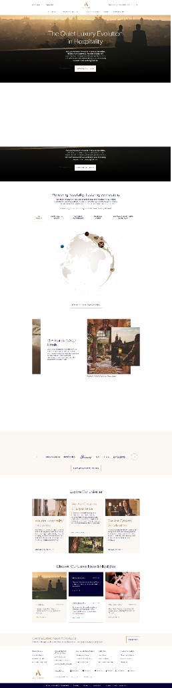
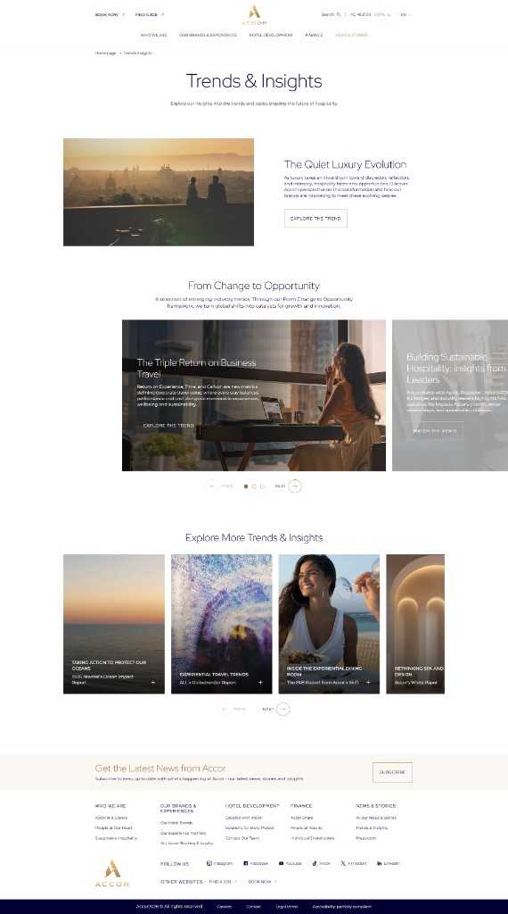
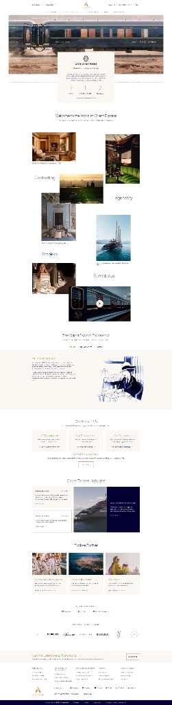
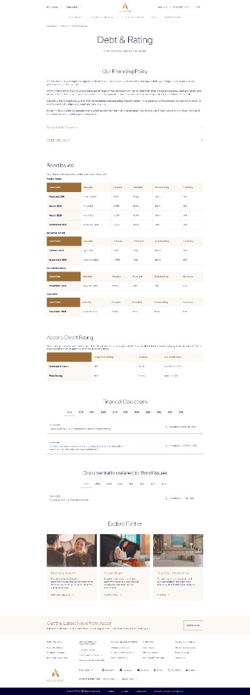

# DESIGN.md — Design Guideline Website Holding Korporat **EBI Resources**

> Panduan UI/UX yang komprehensif dan siap-pakai untuk membangun website holding korporat **EBI Resources**.
> Gaya visual diadaptasi dari referensi **Accor Group** ([group.accor.com](https://group.accor.com/en)) dengan filosofi *quiet luxury* korporat.
> Dokumen ini ditujukan untuk **desainer** dan **developer front-end**. Semua token, komponen, dan pola dapat langsung diimplementasikan.

---

## Daftar Isi

1. [Pendahuluan & Filosofi Desain](#1-pendahuluan--filosofi-desain)
2. [Design Tokens](#2-design-tokens)
3. [Component Library](#3-component-library)
4. [Pola Penyajian Gambar & Art Direction](#4-pola-penyajian-gambar--art-direction)
5. [Sistem Motion & Animasi](#5-sistem-motion--animasi)
6. [Arketipe Halaman (Template)](#6-arketipe-halaman-template)
7. [Pemetaan ke Halaman EBI Resources](#7-pemetaan-ke-halaman-ebi-resources)
8. [Checklist Implementasi & Do/Don't](#8-checklist-implementasi--dodont)

---

## 1. Pendahuluan & Filosofi Desain

### 1.1 Tentang EBI Resources

**EBI Resources** adalah perusahaan holding yang menaungi beberapa unit bisnis:

| Lini Bisnis | Unit / Brand |
|---|---|
| **Hotels** | Hadith, Kampoeng Indonesia, Graha Nusantara, Mecca |
| **Restaurants** | Kampoeng Indonesia, Mecca Hotel Restaurants |
| **Café** | 7oz Espresso |
| **IT & Technology** | AI, Cybersecurity, Blockchain, Automatic Control Systems, Data Integration |
| **Travel** | *Coming Soon* |

Website ini bersifat **corporate profile & business portfolio** — **BUKAN** situs transaksional. Tidak ada modul reservasi, pembayaran, atau CMS publik. Tujuannya adalah membangun **kredibilitas, kepercayaan, dan citra premium** di mata pemangku kepentingan.

### 1.2 Audiens

- **Audiens utama (prioritas desain):** calon mitra bisnis, investor, dan calon klien IT.
- **Audiens sekunder:** publik/tamu, media, calon karyawan.

> **Implikasi desain:** setiap keputusan visual harus mengomunikasikan **stabilitas, presisi, dan kelas**. Nada bicara profesional-hangat, bukan playful atau diskon-driven.

### 1.3 Sumber Referensi & Tujuan Adaptasi

Referensi visual utama adalah **Accor Group** ([group.accor.com](https://group.accor.com/en)) — situs holding korporat yang menampilkan *quiet luxury* korporat: whitespace luas, palet diredam, tipografi kontras tinggi, sudut tajam, dan fotografi sinematik.



**Tujuan adaptasi ke EBI Resources:** meminjam *sistem visual* Accor (bukan meniru konten) untuk memposisikan EBI sebagai holding terpercaya berkelas, sambil menonjolkan keragaman lini bisnis (hospitality + teknologi) dan memberi ruang khusus untuk **Investor Relations** (data-heavy) dan **IT & Technology** (showcase untuk calon klien).

### 1.4 Prinsip Desain Inti ("Quiet Luxury" Korporat)

1. **Whitespace = kemewahan.** Ruang kosong yang murah hati adalah pernyataan status. Base putih/krem menutupi **85–90%** area.
2. **Warna hemat.** Palet diredam (putih–krem–navy) dengan aksen emas/bronze **maksimal ~5%**. Warna dipakai untuk hierarki, bukan dekorasi.
3. **Kontras tipografi lebar.** Heading serif besar anggun (weight ringan) berpasangan dengan micro-label kapital ber-*tracking* lebar. Kontras skala menciptakan drama tanpa warna.
4. **Sudut tajam (0px).** Semua elemen bersudut siku untuk kesan presisi & arsitektural. Pengecualian tipis hanya pada header baris tabel.
5. **Fotografi sinematik.** Foto *warm golden-hour*, manusia-sentris/heritage, penuh mood. Foto adalah "mewah"; grafik dekoratif diminimalkan.
6. **Konsistensi navy–emas–ivory** dari header hingga footer.

**Nada keseluruhan:** tenang, presisi, heritage, terpercaya, eksklusif.

---

## 2. Design Tokens

### 2.1 Palet Warna

| Token | Hex | Swatch | Peran | Aturan Pemakaian |
|---|---|---|---|---|
| `color/base-white` | `#FFFFFF` | `#FFFFFF` | Background utama | 60–70% area |
| `color/cream` | `#F7F3EC` | `#F7F3EC` | Section band lembut (newsletter/CTA/panel data) | ~15–20% area |
| `color/beige` | `#F1ECE1` | `#F1ECE1` | Background hangat kuat (hero intro, carousel brand) | Aksen section |
| `color/gold` | `#B8873B` | `#B8873B` | Aksen emas (tab aktif, link, judul kartu partner) | ≤5% total |
| `color/bronze` | `#9C6D37` | `#9C6D37` | Aksen tegas (header tabel, underline tab data) | ≤5% total |
| `color/navy-text` | `#2A2B4E` | `#2A2B4E` | Teks judul & elemen navy | Teks/heading/blok solid |
| `color/navy-footer` | `#0B1330` | `#0B1330` | Footer bar bawah | Footer & bottom bar |
| `color/ink` | `#1C1B19` | `#1C1B19` | Teks body serif (konten mewah) | Body pada halaman brand |
| `color/text-muted` | `#5A6570` | `#5A6570` | Teks sekunder/caption | Metadata, caption |
| `color/border` | `#E7E6EC` | `#E7E6EC` | Garis pemisah tipis, kartu outline | Border 1px |
| `color/overlay` | `rgba(0,0,0,0.35–0.60)` | — | Overlay gelap atas foto | Hero & kartu portrait |
| `color/data-alert` | `#C0392B` | `#C0392B` | Angka penting (opsional, sangat hemat) | Hanya data finansial |
| `color/zebra` | `#FBF8F3` | `#FBF8F3` | Baris genap tabel | Zebra striping tabel |

**Aturan proporsi warna:**
- Base putih/krem menutupi **85–90%** area.
- Navy hanya untuk **teks, footer, dan blok solid**.
- Emas/bronze **maksimal ~5%** — aksen langka, bukan pengisi.
- Merah (`data-alert`) **hanya** untuk data finansial (mis. delta negatif). Tidak untuk UI umum.

```css
:root {
  /* Base & neutral */
  --color-base-white: #FFFFFF;
  --color-cream:      #F7F3EC;
  --color-beige:      #F1ECE1;
  --color-zebra:      #FBF8F3;

  /* Accent (langka, ≤5%) */
  --color-gold:   #B8873B;
  --color-bronze: #9C6D37;

  /* Ink & navy */
  --color-navy-text:   #2A2B4E;
  --color-navy-footer: #0B1330;
  --color-ink:         #1C1B19;
  --color-text-muted:  #5A6570;

  /* Lines & overlay */
  --color-border:      #E7E6EC;
  --color-overlay:     rgba(0, 0, 0, 0.45);
  --color-data-alert:  #C0392B;
}
```

### 2.2 Tipografi

Sistem **2 keluarga font**:

- **Serif display** — high-contrast (Didone/transitional). Rekomendasi Google Fonts: **Playfair Display** (utama) atau **Cormorant** / **Noto Serif Display** (alternatif). Weight **Light–Regular**, **Title Case**. Untuk heading anggun, brand, About, dan Businesses.
- **Sans humanis** — untuk body, UI, navigasi, label, dan data. Rekomendasi Google Fonts: **Inter** (utama) atau **Nunito Sans** (alternatif hangat). Weight Regular/Medium/Semibold.

```css
:root {
  --font-serif: "Playfair Display", "Cormorant", Georgia, serif;
  --font-sans:  "Inter", "Nunito Sans", system-ui, -apple-system, sans-serif;
}
```

**Skala tipografi (desktop):**

| Peran | Font | Ukuran | Weight | Case & Tracking | Line-height |
|---|---|---|---|---|---|
| Display / H1 | Serif | 40–56px | Light (300) | Title Case, tracking longgar (~0.01em) | 1.1–1.2 |
| H2 | Serif | 28–36px | Light/Regular | Title Case, center | 1.2 |
| H3 | Serif atau Sans | 20–24px | Regular | Title Case | 1.3 |
| Body | Sans | 15–16px | Regular | Sentence case | 1.6–1.8 |
| Body-sm (data/caption) | Sans | 13–14px | Regular | Sentence case | 1.5 |
| Label / Nav / Kicker | Sans | 11–13px | Medium/Semibold | **UPPERCASE**, letter-spacing 0.08–0.14em | 1.4 |
| Table-head | Sans | 11–12px | Semibold | **UPPERCASE**, letter-spacing 0.08em | 1.4 |
| Button | Sans | 12–13px | Semibold | **UPPERCASE**, letter-spacing 0.1em | 1 |

**Aturan kunci tipografi:**
- **Micro-label, nav, tombol, kicker, dan judul kartu** = **UPPERCASE + tracking lebar**.
- **Heading** = Title Case, weight ringan, ukuran besar (kontras skala menciptakan kemewahan).
- **Body** = sans humanis dengan line-height lega (1.6–1.8).
- Jangan gunakan lebih dari 2 keluarga font.

```css
h1, .display {
  font-family: var(--font-serif);
  font-weight: 300;
  font-size: clamp(2.5rem, 5vw, 3.5rem); /* 40–56px */
  line-height: 1.15;
  letter-spacing: 0.01em;
}
.kicker, .nav-item, .btn, .label {
  font-family: var(--font-sans);
  font-weight: 600;
  text-transform: uppercase;
  letter-spacing: 0.1em;
  font-size: 0.75rem; /* 12px */
}
body {
  font-family: var(--font-sans);
  font-size: 1rem; /* 16px */
  line-height: 1.7;
  color: var(--color-navy-text);
}
```

### 2.3 Spacing, Layout & Whitespace

Skala spacing berbasis **8px** (dengan 4px sebagai setengah-langkah):

```css
:root {
  --space-1: 4px;
  --space-2: 8px;
  --space-3: 16px;
  --space-4: 24px;
  --space-5: 32px;
  --space-6: 48px;
  --space-7: 64px;
  --space-8: 96px;
  --space-9: 128px;

  --container-wide:   1200px; /* umum */
  --container-normal: 1100px;
  --container-read:   800px;  /* konten baca / data */
}
```

- **Max-width container umum:** ~1100–1200px.
- **Konten baca / kolom data:** ~800px (`--container-read`).
- **Padding section vertikal:** ~80–120px (`--space-8`–`--space-9`).
- **Grid:**
  - 2 kolom → teks | media, atau kartu utama + sekunder.
  - 3 kolom → kartu brand / explore / partner.
  - 4 kolom → grid portrait editorial.
  - 1 kolom sempit → data/artikel (~800px).
- **Alignment:** judul & intro **center**; isi kartu/editorial/data **rata kiri** (termasuk angka tabel).
- **Prinsip whitespace:** jangan pernah mengisi ruang hanya untuk "penuh". Ruang kosong adalah elemen desain — perbesar padding sebelum menambah konten.

### 2.4 Border-radius, Border & Shadow

```css
:root {
  --radius-default: 0px;   /* sudut tajam untuk SEMUA elemen */
  --radius-table:   4px;   /* pengecualian: header baris tabel (4–6px) */
  --border-hair:    1px solid var(--color-border);
  --shadow-none:    none;  /* kedalaman via warna solid & border, bukan shadow */
}
```

- **Radius default 0px** untuk semua elemen (tombol, kartu, input, gambar).
- **Pengecualian:** header baris tabel boleh ~4–6px.
- **Border tipis 1px** `#E7E6EC` untuk kartu outline & pemisah.
- **Tabel:** hanya garis **horizontal**, tanpa garis vertikal.
- **Shadow nyaris nol.** Kedalaman dicapai lewat kontras warna solid & border, bukan drop-shadow. Jika perlu, gunakan shadow sangat halus (`0 1px 2px rgba(0,0,0,0.04)`) — dan hanya jika benar-benar dibutuhkan.

---

## 3. Component Library

### 3.1 Header 2 Tingkat

**Anatomi:**
- **Utility bar (atas):** CTA sekunder kiri (mis. `PARTNER WITH US` / `CAREERS`), **wordmark teks center** — tulisan **"EBI RESOURCES"** dengan **font serif** (bukan gambar logo), kanan: search + info + toggle bahasa (`EN / ID`, default **English**).
- **Main nav (bawah):** ~5 item menu UPPERCASE ber-tracking lebar. Item aktif = **emas + underline**.

> **Catatan logo (ditangguhkan):** belum ada file logo untuk saat ini. **EBI Resources belum punya logo, dan Mecca belum punya logo**; sebagian besar properti lain punya. Untuk sementara, elemen tengah header = **wordmark teks serif "EBI RESOURCES"**. Ganti ke gambar logo hanya setelah aset logo resmi disediakan.

**State (perilaku scroll — PENTING):**
- **Di atas hero (scroll = 0): header TRANSPARAN** — tanpa background, menumpang di atas media hero. Wordmark & item nav berwarna **terang (putih)** agar terbaca di atas foto/video. Tujuannya: **100% tinggi hero menjadi milik media**, tidak "dimakan" oleh header.
- **Setelah scroll melewati hero (> ~80–100px): header SOLID** — background muncul (ivory/putih atau navy gelap) + **shadow halus** + border-bottom hair; warna wordmark/teks **bertukar (putih → navy)**. Transisi `0.35s`.
- Item aktif/hover: teks emas + underline emas.
- **Catatan:** pola ini **menggantikan** "smart-sticky hide/show" lama. Header **tidak** disembunyikan saat scroll turun — ia hanya bertransformasi dari **transparan → solid**. Detail & kode di §5.3.
- **Alasan desain:** header tebal/permanen (mis. Accor) memakan tinggi hero; header transparan menjaga hero tetap imersif (lihat referensi hero Hadith Hotel & Tata).

```
┌───────────────────────────────────────────────────────────┐
│  PARTNER WITH US · CAREERS   EBI RESOURCES      🔍  ℹ  EN/ID │  ← utility bar
├───────────────────────────────────────────────────────────┤
│      HOME    ABOUT    OUR BUSINESSES    CAREERS   CONTACT    │  ← main nav
└───────────────────────────────────────────────────────────┘
```

### 3.2 Navigation & Mega-Menu Drill-Down

Mengikuti pola Accor: **tombol burger membuka overlay menu layar penuh** (bahkan di desktop), dengan **drill-down multi-level** (bukan mega-menu grid).

**Anatomi:**
- Overlay full-screen (background ivory/navy).
- Level 1: daftar item utama UPPERCASE (mis. `ABOUT`, `OUR BUSINESSES`, `CAREERS`, `CONTACT`).
- Klik item → **sub-panel** (`uiMenuSub`) meluncur, menampilkan sub-item + tombol **BACK** untuk kembali ke level sebelumnya.
- Dikelola atribut ARIA `aria-expanded`; transisi buka-tutup dianimasikan (lihat §5).

**State:** closed → opening (slide/fade) → level-1 → level-2 (dengan BACK) → closing.

### 3.3 Breadcrumb

Kecil, tipis, UPPERCASE atau sentence case ringan, dengan pemisah `/` atau `›`. Diletakkan di atas hero pada halaman internal. Warna `text-muted`, item aktif navy.

```
HOME  /  OUR BUSINESSES  /  IT & TECHNOLOGY
```

### 3.4 Hero (2 Varian)

**Prinsip utama (PENTING): teks jangan memenuhi hero.** Media (gambar/video) adalah bintang utama. Teks hanya **kicker + judul + 1 kalimat + CTA**, dikurung di **satu area (kiri-bawah)**, berukuran **sedang–besar** — "kelihatan dan terbaca", **bukan** raksasa yang mendominasi. Referensi: hero **Hadith Hotel** (serif, elegan, teks kiri-bawah) dan **Tata** (rapi, kiri-bawah, ada scroll cue).

**Varian A — Full-bleed media + scrim (default untuk Home & properti):**
- **Slot media fleksibel: gambar ATAU video.** Siapkan slotnya sejak awal meski media diisi belakangan. Video: `autoplay muted loop playsinline` + `poster` fallback; hormati `prefers-reduced-motion` (matikan video → pakai poster).
- **Scrim (bukan overlay penuh):** gradasi gelap halus **hanya di area teks** (mis. dari kiri-bawah), agar teks putih terbaca tanpa menggelapkan seluruh media. Gunakan `--color-overlay` seperlunya.
- **Tinggi hero:** ~**85–100vh** (imersif), sisakan sedikit "peek" section berikutnya untuk mengundang scroll.
- **Header transparan** menumpang di atas hero (lihat §3.1).
- **Susunan teks (kiri-bawah), lebar area ~40–50% desktop:**
  - Kicker kecil UPPERCASE tracking lebar (1 baris) — mis. `COMPLEX OF IMAM AL BUKHARI · SAMARKAND`.
  - Judul serif **sedang–besar** (1–2 baris).
  - Supporting **1 kalimat pendek** (maks ~2 baris).
  - **1 CTA utama** (+ 1 sekunder opsional).
- **Scroll cue** (chevron `⌄`) di bawah untuk menandai ada konten lanjut.

**Varian A-Homepage — Rotating showcase (carousel):**
- Homepage memakai hero **berputar (auto-advance)** ala Tata: tiap slide = **1 properti** dengan kicker + judul sendiri, plus **progress bar** + scroll cue.
- **Isi & urutan slide (hotel diprioritaskan):** Hadith (flagship 5★) → Mecca → Graha Nusantara → Kampoeng Indonesia → **1 slide restoran** (foto F&B terbaik) → **7OZ (café)** bila ada foto yang bagus. Target ~5–6 slide.
- **Kurasi foto hero (kriteria):** landscape/16:9, resolusi tinggi, sinematik (utamakan folder **Render / Exterior / Night Scene**), **bersih** (tanpa watermark, layout plan, logo, atau wajah yang terlalu identifiable), **distinct** (tanpa duplikat/near-duplikat), dan **mood antar-slide konsisten**.
- **JANGAN** menaruh statistik/angka yang belum dikonfirmasi di hero (lihat guardrail anti-fabrikasi).

**Varian B — Teks-only center:**
- Untuk halaman data/korporat (mis. Investor Relations, Contact).
- Judul serif besar center di atas background putih/cream, tanpa foto.

### 3.5 Tombol (Buttons)

| Varian | Deskripsi | Case | Default hover |
|---|---|---|---|
| `btn/filled` | Solid (putih/navy), sudut tajam | UPPERCASE | shift background-color 0.2s |
| `btn/outline` (ghost) | Border 1px transparan — **paling sering dipakai** | UPPERCASE | shift border/background 0.2s |
| `btn/text-link` | Teks emas + panah `→` | UPPERCASE atau Title Case | color shift + panah geser |

```css
.btn {
  display: inline-flex;
  align-items: center;
  gap: var(--space-2);
  padding: 14px 28px;
  font: 600 0.75rem/1 var(--font-sans);
  text-transform: uppercase;
  letter-spacing: 0.1em;
  border-radius: var(--radius-default);
  cursor: pointer;
  transition: background-color 0.2s cubic-bezier(0.25, 1, 0.5, 1),
              border-color 0.2s cubic-bezier(0.25, 1, 0.5, 1),
              color 0.2s cubic-bezier(0.25, 1, 0.5, 1);
}
.btn--filled  { background: var(--color-navy-text); color: #fff; border: 1px solid var(--color-navy-text); }
.btn--filled:hover  { background: #1c1d38; }
.btn--outline { background: transparent; color: var(--color-navy-text); border: 1px solid var(--color-navy-text); }
.btn--outline:hover { background: var(--color-navy-text); color: #fff; }
.btn--text    { background: none; border: none; color: var(--color-gold); padding: 0; }
.btn--text .arrow { transition: transform 0.2s cubic-bezier(0.25, 1, 0.5, 1); }
.btn--text:hover .arrow { transform: translateX(4px); }
```

### 3.6 Kartu (Cards)

| Varian | Anatomi |
|---|---|
| `card/image` | Foto atas + panel cream + judul + `READ MORE →` |
| `card/navy-solid` | Blok navy solid, teks putih (statistik/highlight) |
| `card/outline` | Border 1px, banyak padding, minimalis |
| `card/portrait-overlay` | Foto portrait + overlay gelap + judul UPPERCASE putih + **ikon `+`** di pojok kanan bawah |

Semua kartu bersudut tajam (0px). Foto pada kartu memakai `overflow: hidden` untuk efek zoom hover (lihat §5).

### 3.7 Carousel (Swiper.js)

**Anatomi:** panah **lingkaran outline** kiri/kanan + **dot pagination** + label `SWIPE`. Kartu sekunder sengaja **terpotong** di tepi sebagai isyarat bisa di-swipe.

Gunakan **Swiper.js** (terkonfirmasi pada referensi). Lihat §5 untuk konfigurasi easing.

### 3.8 Pagination PREV/NEXT

Panah **lingkaran** dengan label `PREV` / `NEXT`. Dipakai pada listing editorial (mis. Careers, News).

### 3.9 Tab

Underline **emas/bronze** pada tab aktif (mis. tab tahun pada Investor Relations). Label UPPERCASE, tracking lebar. Tab non-aktif = `text-muted`.

### 3.10 Accordion

Untuk memadatkan data/FAQ/sejarah. Baris judul dengan ikon `+`/`−` atau chevron. Sudut tajam, pemisah garis horizontal 1px. Transisi buka-tutup halus (lihat §5).

### 3.11 Tabel Data

**Anatomi:**
- **Header row bronze solid** `#9C6D37`, teks putih UPPERCASE (sudut sedikit membulat, ~4–6px).
- Kolom-1 = label **bold navy**.
- **Zebra striping** halus (putih/cream `#FBF8F3`).
- Hanya **garis horizontal** tipis (tanpa garis vertikal).
- Padding sel besar; numerik **rata kiri**.

```css
.data-table { width: 100%; border-collapse: collapse; font-size: 0.875rem; }
.data-table thead th {
  background: var(--color-bronze);
  color: #fff;
  text-transform: uppercase;
  letter-spacing: 0.08em;
  font: 600 0.75rem/1.4 var(--font-sans);
  padding: 14px 20px;
  text-align: left;
  border-radius: var(--radius-table) var(--radius-table) 0 0;
}
.data-table td { padding: 16px 20px; border-bottom: var(--border-hair); text-align: left; }
.data-table tbody tr:nth-child(even) { background: var(--color-zebra); }
.data-table td:first-child { font-weight: 700; color: var(--color-navy-text); }
```

### 3.12 Blok Download PDF

Judul kiri + ikon `↓` + label kanan (`DOWNLOAD · PDF · <size>`) dipisah garis tipis 1px. Baris-baris ini disusun vertikal pada halaman Investor Relations.

```
Annual Report 2025 ───────────────────  ↓  DOWNLOAD · PDF · 2.4 MB
Company Profile ─────────────────────  ↓  DOWNLOAD · PDF · 1.1 MB
```

### 3.13 Newsletter / CTA Band

> **⏸️ Ditangguhkan — tidak masuk build awal.** Band newsletter **di-skip untuk sekarang**. Spesifikasi di bawah dipertahankan sebagai referensi, tetapi **jangan** dibangun pada iterasi pertama. (Band CTA kemitraan biasa tetap boleh; yang ditunda spesifik komponen *newsletter*/langganan.)

Panel **cream** full-width + judul serif + input + tombol **outline**. Dipakai menjelang footer di hampir semua halaman. Untuk EBI, CTA condong ke **kemitraan** (mis. "Partner with EBI Resources").

### 3.14 Footer 5 Kolom + Bottom Bar Navy

> **⏸️ Disederhanakan / ditangguhkan — tidak masuk build awal.** Untuk sekarang, **skip** kolom link footer, media sosial (`FOLLOW US`), tautan legal, dan copyright. Gunakan footer **minimal** (mis. hanya wordmark "EBI RESOURCES" + bar navy tipis). Spesifikasi lengkap 5-kolom di bawah **dipertahankan** sebagai referensi dan diaktifkan nanti setelah konten & aset (social/legal) tersedia.

**Anatomi (spesifikasi lengkap — deferred, bukan build awal):**
- 5 kolom link (mis. About, Businesses, Careers, Contact, Legal).
- Wordmark teks "EBI RESOURCES" (belum ada logo — lihat §3.1).
- `FOLLOW US` + ikon sosial.
- **Bottom bar navy gelap** (`#0B1330`) untuk legal/copyright.

---

## 4. Pola Penyajian Gambar & Art Direction

Fotografi adalah pembawa "kemewahan" utama. Gunakan foto **warm sinematik golden-hour, manusia-sentris** (tim, properti, meeting, hospitality) dan konteks korporat/heritage.



**Pola-pola art direction:**

1. **Full-bleed hero + overlay** — foto full-width dengan overlay gradasi gelap, teks putih.
2. **Kolase bertumpuk (overlapping)** — beberapa foto saling menumpuk, sudut tajam, untuk section statistik/heritage.
3. **Mosaik / masonry asimetris** — staggered dengan whitespace besar + **label kata tunggal serif** (mis. *Enchanting*, *Legendary*, *Timeless*, *Sumptuous* → untuk EBI: *Trusted*, *Crafted*, *Enduring*, *Innovative*).
4. **Kartu portrait overlay + ikon `+`** — grid 4 kolom editorial.
5. **Thumbnail bulat** — untuk avatar/globe/POI.
6. **Ilustrasi dotted/monokrom** — globe titik taupe, atau artwork art-deco vintage navy (heritage).
7. **Video thumbnail + tombol play bundar**.
8. **Baris horizontal (row / filmstrip)** — foto **berjejer kiri→kanan**. Penyeimbang pola asimetris (#2/#3) agar halaman berirama, tidak monoton. Empat varian:
   - **8a. Baris kartu setara** — 3–4 foto berukuran sama sejajar. Untuk **kartu properti** & **5 lini bisnis** (rapi, mudah dibandingkan).
   - **8b. Horizontal scroll / filmstrip** — deretan foto yang digeser horizontal (drag/scroll), boleh melebihi lebar layar. Untuk **galeri properti** & **portfolio**.
   - **8c. Carousel horizontal** — filmstrip dengan auto-advance/panah, 1–2 item fokus. Untuk **highlight/berita**.
   - **8d. Baris staggered horizontal** — sejajar horizontal tapi tinggi/offset vertikal sedikit naik-turun ("perspektif") untuk ritme, tetap sudut siku.
9. **Sudut siku (0px)** untuk semua gambar.

**Prinsip variasi (PENTING):** jangan pakai satu pola untuk semua section. Selang-seling pola per konteks agar halaman berirama:

| Section | Pola foto |
|---|---|
| Hero | Full-bleed rotating (#1) |
| Intro / heritage / positioning | Kolase bertumpuk (#2) |
| Nilai / brand pillars | Mosaik asimetris + label serif (#3) |
| Portofolio properti / lini bisnis | Baris horizontal (#8a / #8b) |
| Galeri di halaman properti | Horizontal scroll/filmstrip (#8b) atau mosaik (#3) |
| Highlight / berita | Carousel horizontal (#8c) |
| Data / finance | Minim foto — biarkan tabel & tipografi bicara |



Untuk halaman **data/finance**, tahan diri dari foto dekoratif berlebihan — biarkan tipografi dan tabel yang berbicara.



---

## 5. Sistem Motion & Animasi

> **SANGAT PENTING.** Motion adalah pembeda "premium". Semua nilai berikut diturunkan dari laporan analisis live-site (Playwright/Chromium) terhadap referensi Accor.

### 5.1 Prinsip Motion

- **Satu kurva easing utama:** `cubic-bezier(0.25, 1, 0.5, 1)` (**easeOutQuart** — ease-out tegas). Dipakai konsisten di seluruh interaksi → kesan profesional/premium.
- **Gradasi durasi disiplin:**
  - **Micro** (hover warna/border): `0.2s`
  - **Struktural** (header transparan→solid, menu): `0.35s`
  - **Gambar/hero** (zoom, fade hero, parallax): `1s – 1.5s`

```css
:root {
  --ease-primary: cubic-bezier(0.25, 1, 0.5, 1); /* easeOutQuart */
  --dur-micro: 0.2s;
  --dur-struct: 0.35s;
  --dur-image: 1s;
  --dur-hero: 1.5s;
}
```

### 5.2 Scroll & Hero

- **Hero pin / scroll-driven** — hero **di-pin** menggunakan **GSAP ScrollTrigger** (`pin: true`, menghasilkan `pin-spacer`). Hero ber-`translateY` progresif mengikuti scroll lalu dilepas ke section berikutnya.
- **Parallax / ken-burns** — gambar hero `scale(1.05)`, tinggi > kontainer, offset `top: -25px` untuk efek ken-burns halus.
- **Reveal fade-up per-section** — tidak agresif di desktop; reveal utama terjadi pada sekuens hero pin. Untuk EBI, reveal ringan boleh via Intersection Observer.

### 5.3 Header: Transparan → Solid saat Scroll

Header **selalu terlihat** (tidak hide/show). Perubahannya adalah **background & warna teks** saat user meninggalkan hero:

- **Di hero (top):** transparan, teks/wordmark **putih**, tanpa shadow.
- **Melewati ambang (~80–100px):** tambahkan class `is-scrolled` → background solid (ivory/putih atau navy), teks/wordmark **navy**, shadow + border-bottom hair.
- Transisi background/warna/shadow: `0.35s var(--ease-primary)`.

```css
.site-header {
  position: fixed; top: 0; left: 0; right: 0;
  background: transparent;
  color: #fff;                 /* wordmark & nav putih di atas hero */
  box-shadow: none;
  transition:
    background-color var(--dur-struct) var(--ease-primary),
    color            var(--dur-struct) var(--ease-primary),
    box-shadow       var(--dur-struct) var(--ease-primary);
}
.site-header.is-scrolled {
  background: var(--color-ivory);       /* atau navy gelap */
  color: var(--color-navy-text);
  box-shadow: 0 1px 0 rgba(0,0,0,0.06), 0 8px 24px rgba(0,0,0,0.06);
  border-bottom: var(--border-hair);
}
```

```js
// toggle via scroll position (ambang ~ tinggi hero atau ~80–100px)
const header = document.querySelector('.site-header');
const onScroll = () => header.classList.toggle('is-scrolled', window.scrollY > 80);
window.addEventListener('scroll', onScroll, { passive: true });
onScroll();
```

> Untuk presisi maksimal, ambang bisa diikat ke **akhir hero** (mis. via IntersectionObserver pada elemen hero) alih-alih angka px tetap.

### 5.4 Fade-in Judul Hero

Judul hero: `opacity 0 → 1` selama **~1.5s** ease-out (tanpa translate).

```css
.hero-title { opacity: 0; transition: opacity var(--dur-hero) var(--ease-primary); }
.hero-title.is-in { opacity: 1; }
```

### 5.5 Hover Interactions

- **Tombol/ikon:** `transition: background-color/border-color/color 0.2s var(--ease-primary)`.
- **Kartu/gambar (image-zoom):** skala dasar `scale(1.05)`, saat hover zoom lambat via `transition: transform 1s var(--ease-primary)`; container `overflow: hidden`.

```css
.card__media { overflow: hidden; }
.card__media img {
  transform: scale(1.05);
  transition: transform var(--dur-image) var(--ease-primary);
}
.card:hover .card__media img { transform: scale(1.12); }
```

### 5.6 Globe WebGL Interaktif (Opsional untuk EBI)

Referensi Accor menggunakan **globe WebGL** (`<canvas>`, kemungkinan three.js) dengan ~210 marker POI DOM yang fade in/out + panel filter. **Untuk EBI**, ini opsional — bisa dipakai sebagai **peta lokasi properti/kantor** interaktif di Home atau Contact. Jika tidak, gunakan ilustrasi peta dotted statis.

### 5.7 Carousel & Menu Overlay

- **Carousel:** gunakan **Swiper.js** (`swiper-initialized`, `swiper-slide-active`). Terapkan easing utama pada transisi slide.
- **Menu overlay drill-down** dianimasikan (slide/fade sub-panel + tombol BACK), dikelola `aria-expanded`.

### 5.8 Aksesibilitas — `prefers-reduced-motion`

Selalu sediakan fallback tanpa motion:

```css
@media (prefers-reduced-motion: reduce) {
  *, *::before, *::after {
    animation-duration: 0.01ms !important;
    animation-iteration-count: 1 !important;
    transition-duration: 0.01ms !important;
    scroll-behavior: auto !important;
  }
}
```
Untuk GSAP ScrollTrigger, deteksi `window.matchMedia('(prefers-reduced-motion: reduce)')` dan nonaktifkan pin/parallax bila aktif.

### 5.9 Tabel Timing & Easing

| Interaksi | Durasi | Easing | Teknik |
|---|---|---|---|
| Fade-in judul hero | ~1.5s | easeOutQuart | CSS transition opacity |
| Header transparan→solid (saat scroll lewat hero) | 0.35s | easeOutQuart | CSS transition background/color/shadow + toggle class `is-scrolled` |
| Hover tombol/ikon (color/border) | 0.2s | easeOutQuart | CSS transition |
| Zoom gambar kartu (hover) | 1.0s | easeOutQuart | CSS transition transform |
| Hero pin / parallax | scroll-driven | — | GSAP ScrollTrigger (pin) |
| Parallax gambar (ken-burns) | scroll-driven | — | scale(1.05) + top offset |
| POI globe fade | ~0.3–0.5s | ease-out | WebGL + DOM fade |
| Slide carousel | ~0.4–0.6s | easeOutQuart | Swiper.js |
| Reveal fade-up section | ~0.6–0.8s | easeOutQuart | Intersection Observer + CSS |

### 5.10 Rekomendasi Stack Implementasi untuk EBI

- **Framework:** React/Next.js (sesuai referensi).
- **Scroll-driven hero & pin:** **GSAP + ScrollTrigger**.
- **Reveal ringan:** **Intersection Observer + CSS transitions** (lebih murah dari GSAP untuk reveal sederhana).
- **Carousel:** **Swiper.js**.
- **Micro-interactions:** murni **CSS transitions** dengan `--ease-primary`.
- **Globe (opsional):** three.js / WebGL.
- **Wajib:** hormati `prefers-reduced-motion`.

---

## 6. Arketipe Halaman (Template)

### (a) Homepage

```
Hero full-bleed (pin/scroll-driven)
  → Pengantar + ilustrasi (globe/peta dotted)
  → Statistik besar (2 kolom: teks | kolase foto)
  → Carousel brand/unit bisnis (band beige)
  → "Explore Our Universe" (3 kartu)
  → News & Highlights (grid kartu campuran)
  → Newsletter/CTA band (cream)
  → Footer
```
Kartu paling variatif; hero paling sinematik.

### (b) Editorial / Listing

```
Header + breadcrumb
  → Hero artikel split 50/50
  → Section unggulan (2 kolom besar; kartu terpotong = carousel)
  → Grid 4 kolom kartu portrait overlay + "+"
  → Carousel + pagination PREV/NEXT
  → Newsletter (cream)
  → Footer
```
CTA outline. Untuk News, Careers.

### (c) Data-heavy

```
Hero teks-only center (serif)
  → 1 kolom sempit (~800px)
  → Tab tahun (underline bronze) + accordion
  → Tabel data (header bronze)
  → Blok download PDF
  → "Explore Further" (3 kolom)
  → Newsletter → Footer navy
```
Dua font paling jelas; warna = hierarki; tanpa foto dekoratif berlebih; tanpa chart. Untuk Investor Relations, Contact.

### (d) Brand / Showcase Mewah

```
Hero full-bleed + kartu identitas mengambang (crest + 3 statistik)
  → Judul serif center + galeri mosaik asimetris + label puitis
  → Video
  → Blok editorial heritage (ilustrasi vintage)
  → Highlights (split editorial + panel navy)
  → "Exclusive Partner" (grid 3 kartu)
  → Deret logo partner monokrom
  → Newsletter + Footer
```
Serif high-contrast dominan; whitespace ekstrem; emas paling terasa; kuratorial/eksklusif. Untuk About, sub-halaman unit bisnis, IT & Technology.

---

## 7. Pemetaan ke Halaman EBI Resources

> **Prioritas audiens:** mitra bisnis, investor, calon klien IT. Nada: holding korporat terpercaya + berkelas.

| Halaman EBI | Arketipe | Adaptasi Konkret |
|---|---|---|
| **Home** | (a) Homepage | **Hero rotating showcase** (Varian A-Homepage §3.4): slide per properti (hotel diprioritaskan → 1 resto → 7OZ), teks ringkas kiri-bawah + scroll cue, header transparan→solid. "Our Universe" = kartu **5 unit bisnis**; **Travel** = badge `COMING SOON`. News & Highlights. Newsletter/CTA **kemitraan**. **Hindari statistik yang belum dikonfirmasi** (jangan tampilkan angka fabrikasi). |
| **About EBI** — Company Overview, Vision & Mission, Board of Directors | (d) Showcase + editorial | Narasi heritage & visi holding; galeri mosaik (kantor/tim/milestone) + label puitis nilai (*Trusted*, *Crafted*, *Enduring*). Timeline/accordion sejarah. Board of Directors = grid kartu portrait. Fokus **membangun trust investor**. |
| **Our Businesses** (landing) | (b) Editorial/Listing | Grid kartu per unit (**portrait overlay + "+"**). Klik → sub-halaman Showcase per unit. |
| → **Hotels** (Hadith, Kampoeng Indonesia, Graha Nusantara, Mecca) | (d) Showcase | Hero full-bleed properti + galeri mosaik + statistik per hotel. |
| → **Restaurants** (Kampoeng Indonesia, Mecca) | (d) Showcase | Fotografi kuliner warm sinematik + editorial. |
| → **Café** (7oz Espresso) | (d) Showcase | Showcase brand café, mood hangat. |
| → **IT & Technology** (AI, Cybersecurity, Blockchain, Automatic Control Systems, Data Integration) | (d) Showcase + (b) | **Ruang khusus untuk calon klien IT:** kartu layanan, studi kasus, deret **logo klien monokrom**. Nada modern-presisi (boleh sans-light heading). CTA `TALK TO OUR TEAM`. |
| → **Travel** | Kartu Coming Soon | Kartu **`COMING SOON` elegan** (portrait overlay + badge), tanpa sub-halaman penuh. |
| **Careers** | (b) Editorial/Listing | Hero split + grid kartu lowongan + filter **tab** + **pagination PREV/NEXT** + CTA outline `APPLY`. |
| **Contact** | (c) Data-heavy ringan + form | 1 kolom sempit; form input **siku** + tombol outline; blok info kantor (**accordion per lokasi**); peta (opsional globe/dotted). |
| **Investor Relations** (bagian dari Contact/About) | (c) Data-heavy | **Tabel data** (header bronze) + **blok download PDF** (laporan, company profile); tab tahun (underline bronze). Prioritas tinggi untuk audiens investor. |

**Rekomendasi token & pola khusus EBI:**
- **Warna:** navy `#2A2B4E` korporat utama + emas/bronze aksen; base putih + cream.
- **Header 2 tingkat:** utility (`PARTNER WITH US` / `CAREERS` + **wordmark teks "EBI RESOURCES"** center + toggle `EN/ID`, default English); main nav: **Home · About · Our Businesses · Careers · Contact**.
- **Sudut tajam 0px** di seluruh situs.
- **Serif display** untuk brand/About/Businesses; **sans-light heading** boleh di Home/Contact/data.
- **Sans humanis** untuk body/UI/data.
- **Investor** → arketipe data-heavy; **klien IT** → showcase + logo klien monokrom.
- **Fotografi** warm sinematik konteks korporat (tim/properti/meeting/hospitality).

---

## 8. Checklist Implementasi & Do/Don't

### 8.1 Checklist Implementasi

- [ ] Definisikan `:root` variables (warna, font, spacing, easing) sebagai satu-satunya sumber kebenaran.
- [ ] Impor **Playfair Display** + **Inter** dari Google Fonts (dengan `font-display: swap`).
- [ ] Set radius default **0px** global; kecualikan header tabel (4–6px).
- [ ] Terapkan `--ease-primary` `cubic-bezier(0.25,1,0.5,1)` pada semua transition.
- [ ] Header transparan di atas hero → solid saat scroll (toggle `is-scrolled`, transisi 0.35s).
- [ ] Hero fade-in 1.5s + (opsional) GSAP ScrollTrigger pin.
- [ ] Kartu image-zoom hover (scale 1.05 → 1.12, 1s, `overflow: hidden`).
- [ ] Carousel via Swiper.js (panah lingkaran + dot + label SWIPE).
- [ ] Menu overlay drill-down + tombol BACK + `aria-expanded`.
- [ ] Tabel: header bronze, zebra halus, garis horizontal saja.
- [ ] Blok download PDF + Investor Relations tab tahun.
- [ ] ~~Footer 5 kolom + bottom bar navy `#0B1330`.~~ **Ditangguhkan** — build awal pakai footer minimal (skip kolom link, sosial, legal, copyright). Lihat §3.14.
- [ ] ~~Newsletter/CTA band cream berorientasi kemitraan.~~ **Ditangguhkan** — skip band newsletter di build awal. Lihat §3.13.
- [ ] Elemen tengah header = **wordmark teks serif "EBI RESOURCES"** (belum ada gambar logo; EBI & Mecca belum punya logo). Lihat §3.1.
- [ ] Toggle bahasa `EN / ID` dengan **default English** (bilingual: EN utama, ID sekunder).
- [ ] Travel = kartu `COMING SOON` elegan.
- [ ] IT & Technology = showcase + logo klien monokrom + CTA klien.
- [ ] `prefers-reduced-motion` fallback aktif.
- [ ] Uji kontras teks (WCAG AA) — terutama teks putih di atas overlay & emas di atas cream.
- [ ] Responsif: skala tipografi `clamp()`, grid runtuh ke 1–2 kolom di mobile.

### 8.2 Do / Don't

**DO**
- Gunakan whitespace luas; perbesar padding sebelum menambah konten.
- Batasi emas/bronze ke ≤5% area.
- Gunakan foto warm sinematik manusia-sentris berkualitas tinggi.
- Pertahankan sudut tajam 0px secara konsisten.
- Gunakan satu kurva easing di seluruh situs.
- Rata kiri untuk data/angka; center untuk judul & intro.
- Prioritaskan kejelasan bagi investor/mitra/klien IT.

**DON'T**
- Jangan pakai drop-shadow tebal atau sudut membulat besar.
- Jangan gunakan warna cerah/jenuh atau lebih dari 2 keluarga font.
- Jangan penuhi layout hanya demi "ramai".
- Jangan pakai animasi bounce/berlebihan atau durasi tidak konsisten.
- Jangan gunakan merah di luar konteks data finansial.
- Jangan letakkan foto dekoratif berlebihan di halaman data-heavy.
- Jangan lupakan `prefers-reduced-motion` & kontras aksesibilitas.

---

*Dokumen ini adalah design guideline hidup untuk EBI Resources. Perbarui token dan komponen di sini terlebih dahulu, lalu sinkronkan ke kode agar konsistensi tetap terjaga.*
